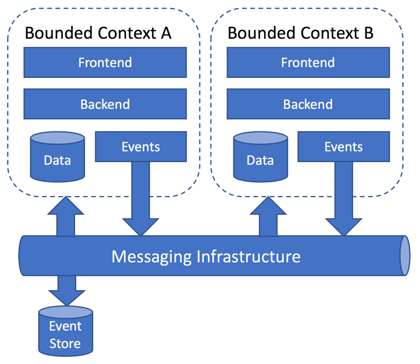
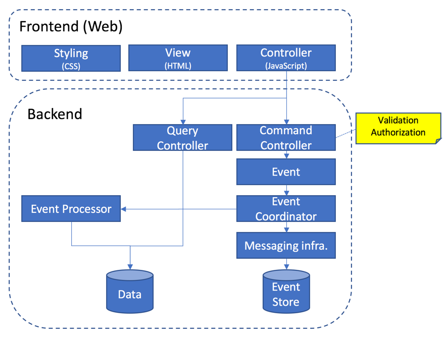

# At a glance

This article describes at a high level without going into too much details how the architecture works.

From a top level you'll find the different [bounded contexts](./bounded_contexts.md) (Concretely defined [here](../Projects/index.md).

Diving into the architecture within a bounded context, you'll find the following:

## The details

For more details on the different parts and design decisions behind and more importantly; **the why**, please read the following:

* [Glossary](./glossary.md)
* [Principles](./principles.md)
* [DDD at a glance](./ddd.md)
* [Bounded Contexts](./bounded_contexts.md)
* [Commands](./commands.md)
* [Events](./events.md)
* [Event Driven](./event_driven.md)
* [Event Processor](./event_processor.md)
* [Event Store](./event_store.md)
* [Inversion of control](./inversion_of_control.md)
* [Multi Tenancy](./multitenancy.md)
* [Logging](./logging.md)
* [Identity and access](./identity_and_access.md)
* [Frontend](./frontend.md)
* [Persistence](./persistence.md)
* [Partitioning Strategy](./partitioning_strategy.md)
* [Containers](./containers.md)
* [Kubernetes](./kubernetes.md)
* [APIs](./apis.md)