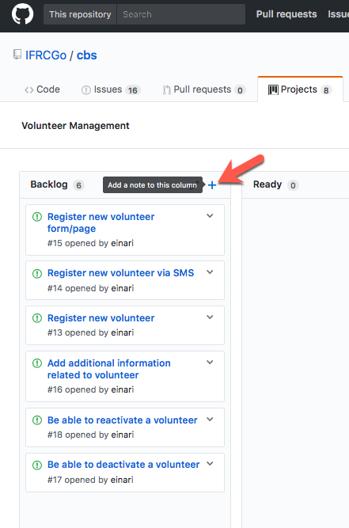
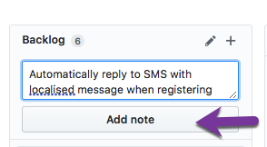
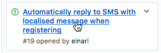

# Issues

The key words “MUST”, “MUST NOT”, “REQUIRED”, “SHALL”, “SHALL NOT”, “SHOULD”, “SHOULD NOT”,
“RECOMMENDED”, “MAY”, and “OPTIONAL” in this document are to be interpreted as described in
[RFC 2119](https://tools.ietf.org/html/rfc2119).

## Backlog

Any issues MUST be associated with a [project](../Projects/index.md). Every project has its own backlog and is the thing that the products owners prioritize from. It is also the thing that product owners will fill out all the details and have discussions around.

## Ready

Once a backlog item is ready to be implemented it lives in the *Ready* column. One SHALL NOT start
implementing anything that is not in this column. It means the product owner does not consider it
ready and not prioritized. If you feel differently or has information to share in the work item/issue,
please do so directly on the issue as we encourage full transparency on this.

You SHOULD always pick issues from the top of the list, as these are the most important items.
When you pick one, assign yourself to the item and move it into the *In Progress* column.
Try to limit the number of items you assign to yourself and have *In Progress*.

## Registering

The easiest or more visual approach to adding an issue/work item to the backlog is to navigate to the
actual projects backlog and add directly from here. However, GitHub does not create an issue when doing so -
but what it calls a Note - we want to convert it to an actual issue.

Start by adding a note:

Then enter the short description of it and add it:

Once added, you can go and convert it:

You will then get a dialog where you can enter more details.

The issue will now be shown in the backlog like follows:

By clicking it you get to the details view of the issue. Here you can add more details, attachments, examples, links and more.

### How to create a good issue / work item / backlog item

Issues need to be broken down to be very atomic and focused. It means, the work for doing something like a user interface part is
different from the work of taking the data that gets transferred from the user interface and turning that into events and ultimately
stored in some sort of database are two different things and potentially also done by two or more different people.
In fact, this would most likely result in at least 3 different issues:

- Capture data - form - frontend
- API for taking in the data - it should include validation rules.
  Typically when registering something, we only want to capture fields that are required. Any optional fields should then
  be considered additional data that needs to be captured outside. We also want to say something about roles and authorization for doing the action.
- Events being triggered from the action would be great to capture as well (remember past-tense)
- Data storage - One or more Event Processors deal with this; how is it stored, could it be stored in multiple places.
  e.g. Stored in a Document database and then indexed by a search? Do we have a reporting need in our bounded context?

## Product Owners

The prioritization of the backlog is done by the [product owners](./product_owners.md).
All the issues in the backlog can be dragged around to form a priority.
The items that are considered ready to be implemented and have all the details can be moved to the
"Ready" column and prioritized with the most important item at the top.
