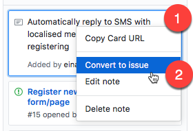
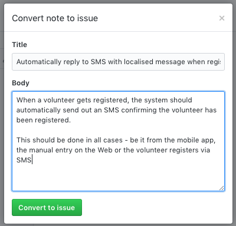
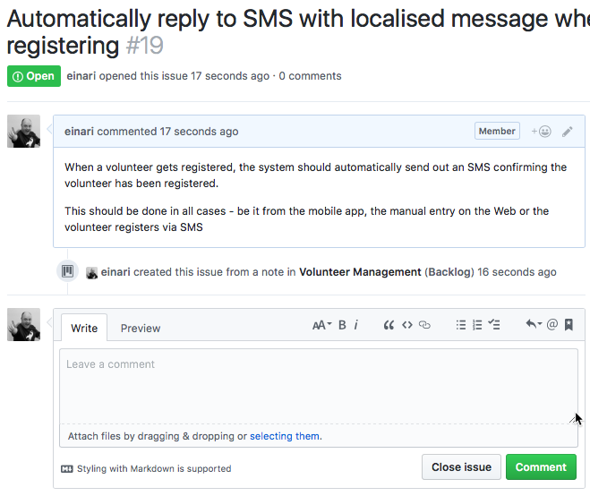

# Product Owners

## Backlog

The easiest or more visual approach to adding an issue/work item to the backlog is to navigate to the actual projects backlog and add directly from here. However, GitHub does not create an issue when doing so - but what it calls a Note - we want to convert it to an actual issue.

Start by adding a note:

Then enter the short description of it and add it:

Once added, you can go and convert it:

You will then get a dialog where you can enter more details.

The issue will now be shown in the backlog like follows:

By clicking it you get to the details view of the issue. Here you can add more details, attachments, examples, links and more.

## Getting ready

All the issues in the backlog can be dragged around to form a priority. The things that are considered ready to be implemented and
have all the details can be moved to the "Ready" column.

## Registering issues

Issues need to be broken down to be very atomic and focused. It means, the work for doing something like a user interface part is
different from the work of taking the data that gets transferred from the user interface and turning that into events and ultimately
stored in some sort of database are two different things and potentially also done by two or more different people.
In fact, this would most likely result in at least 3 different issues:

- Capture data - form - frontend
- API for taking in the data - it should include validation rules.
  Typically when registering something, we only want to capture fields that are required. Any optional fields should then
  be considered additional data that needs to be captured outside. We also want to say something about roles and authorization for doing the action.
- Events being triggered from the action would be great to capture as well (remember past-tense)
- Data storage - One or more Event Processors deal with this; how is it stored, could it be stored in multiple places.
  e.g. Stored in a Document database and then indexed by a search? Do we have a reporting need in our bounded context?
