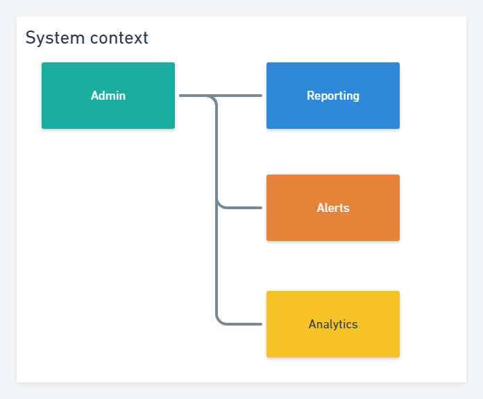
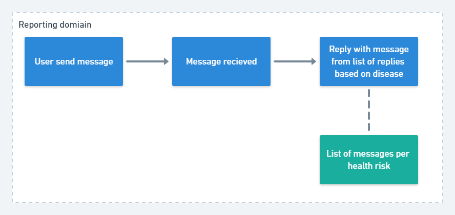
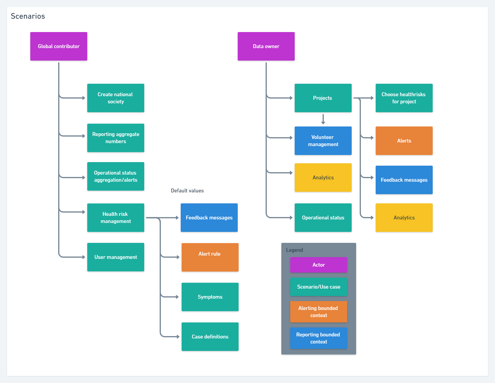
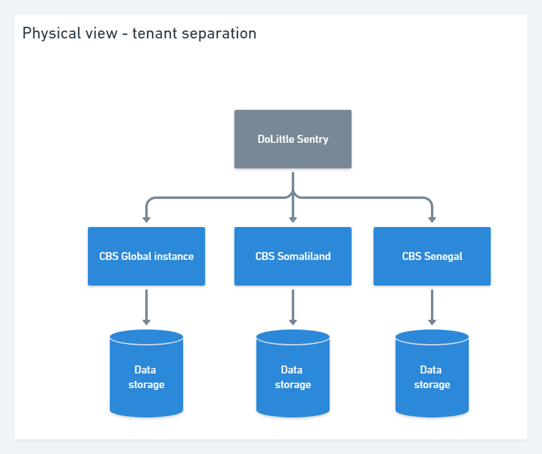

# Admin
Admin's main interests lies within
* System configuration - national societies, projects, health risks defaults
* Operational status
* Cross national societies analytics
* User management

This document is work in progress. 

## System context

* Reporting 
Admin is a stake holder in reporting regarding language of data collector registration and defintion of feedback messages. 

* Alerts 
Admin's interest in reporting lies with configuring default settings for alert rules

* Analytics
Admin needs access to analytics, some reports must be cross national societies. Se physical infrastructure.

## Scenarios

* Create national society 
The creation of national society is currently a manual task performed by DoLittle as automated provisioning is not ready. 

* Operational status
Is the system running, are we getting reports, are we sending alerts? Important on a national society level, and preferably aggregated up to the global level.

* Reporting aggregate numbers
Used to promote CBS, keep track of evolution. This belongs to the analytics domain

* Health risk management
Healthrisk management is deinfed on a global level, and must be inherited down to national societies, with possibilities to override rules and texts. 

  Feedback messages defined for a health risk is related to the reporting domain, the message will be sent as a reply to data collectors upon reception of reports. Feedback message may contain case definitions. 

* Project management 
Projects are defined by the configuration of "Health Risk", geographic location, time duration, and people (care a lot about "Supervisors" and "Data Collectors"). Data owners must be able to create and maintain projects. 

Also, see https://github.com/IFRCGo/cbs/wiki/Glossary:-Ubiquitous-language

    
## Is admin a domain?
Admin is tailored to suit the needs of Global contributor and data owner roles, however large parts of the functionality belongs to different domains, and should be handled there. Perhaps menu navigation will be sufficient UI wise. If an admin "dashboard" is needed for admin, it could be made as a compositional UI adding elements from different bounded countexts (se https://docs.microsoft.com/en-us/dotnet/standard/microservices-architecture/architect-microservice-container-applications/microservice-based-composite-ui-shape-layout and https://jimmybogard.com/composite-uis-for-microservices-a-primer/) 

Perhaps admin should be change into "system setup/configuration" for national societies, while health risks might be a separated bounded context. If health risks is split on different bounded contexts, a composite view providing an overview of an healthrisk with all parts visible.  

## Physical infrastructure 

Each national society exists as a tenant in the system. A tenant has its own datastore. Users are routed to a tenant by the DoLittle sentry by examining URL.

## Noteworthy issues
* Global to local settings https://github.com/IFRCGo/cbs/issues/936

## What can be done now
Creation of projects can be done, however this will not have any value until the other bounded contexts take project into consideration. This will require shared modelling and understanding of how projects will affect reporting, alers and analytics domains. There seems to be some confusion if it represents a part of a tree structure (national society --> project, --> supervisor --> data collector), where a message is related to a specific project through supervisor or if a project is merley a filter on top of all reports. This will also have impact on alerts (some alerts are only for a specific project) and analysis where project will be a filter/dimension. 

It is not possible to create new national societies as DoLittle provisioning is a manual task. 

There is no concept of a global tenant, hence it is not possible to inherit healthrisks to national societies. 

There is no mesasge sharing from national society tenants to a global tenant. Aggregated reporting is not possible for now, or must be solved without. 

Operational status must be defined, and perhaps is related to the notification gateway. 