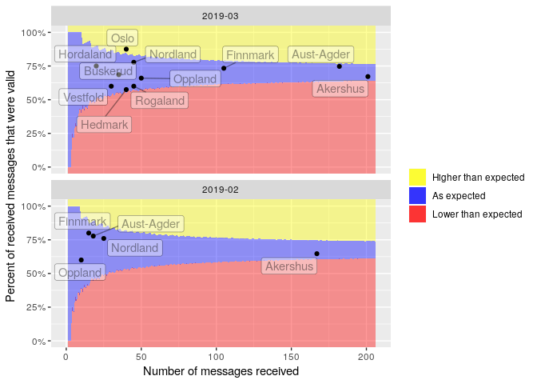
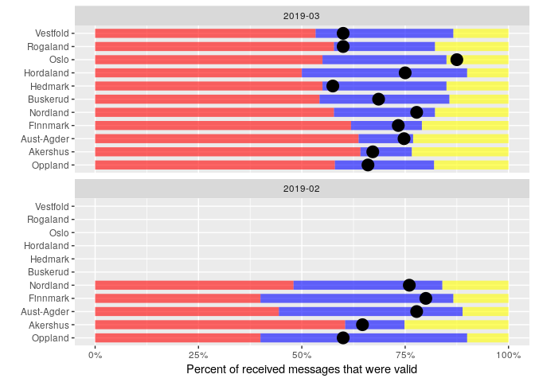

VOLUNTEER INFORMATION
=====================

**THIS INFORMATION HAS BEEN SUPERSCEDED BY THE "PAGES OF MULTIPLE
GRAPHS" SECTION AT THE TOP OF THIS PAGE.**

The previous graphs have been about health risks. We also need
information about the volunteers.

Aggregate information (basic)
-----------------------------

**THIS INFORMATION HAS BEEN SUPERSCEDED BY THE "PAGES OF MULTIPLE
GRAPHS" SECTION AT THE TOP OF THIS PAGE.**

We require a table with each row corresponding to a particular
geographical region (granularity of geographical level will need to be
specified), and two columns:

-   How many volunteers are active
-   How many volunteers are registered

So for example, if granularity is "national" then we would expect only 1
row. If granularity is "district" then we would have 1 row per district.

Individual level information (complicated)
------------------------------------------

**THIS INFORMATION HAS BEEN SUPERSCEDED BY THE "PAGES OF MULTIPLE
GRAPHS" SECTION AT THE TOP OF THIS PAGE.**

We require a table with each row corresponding to an individual
volunteer and multiple columns:

-   Name
-   Location
-   How long they have been engaged
-   Number of days since last report
-   Has reported in the last 0-7 days? \[colored box, blue if yes, red
    if no\]
-   Has reported in the last 8-14 days? \[colored box, blue if yes, red
    if no\]
-   Has reported in the last 15-21 days? \[colored box, blue if yes, red
    if no\]
-   Has reported in the last 22-28 days? \[colored box, blue if yes, red
    if no\]
-   Has reported in the last 29-35 days? \[colored box, blue if yes, red
    if no\]
-   Has reported in the last 36-42 days? \[colored box, blue if yes, red
    if no\]

Note: The 0-7, 8-14, etc numbers are for a weekly example. There will
need to be the option to specify "daily", "weekly", or "monthly".

This table will be linked to a map where the GPS coordinates of each of
the volunteers is displayed. It will be possible to select individuals
using the map, and these selected individuals will then be highlighted
in the above table.

Program statistics
------------------

Is it possible to display this information as summary program
statistics?

-   Number of volunteers
-   % of Red Cross volunteers active the last 30(XX) days
-   Number of trained volunteers / total sum of volunteers
-   Number of active volunteers the last 30 days
-   Number of Red Cross volunteers trained by moths
-   Above information displayed by Age/ sex

District/Person reporting funnel plot A
---------------------------------------

NOTE: THIS SECTION HAS BEEN DOWNGRADED IN PRIORITY. FOR THE MOMENT, DO
NOT IMPLEMENT.

Frontend issue: <https://github.com/IFRCGo/cbs/issues/869>

Backend issue: <https://github.com/IFRCGo/cbs/issues/870>

Chart in Web Template: **NOT COMPLETED YET**

Chart in React frontend: **NOT COMPLETED YET**

Query backend for data: **NOT COMPLETED YET**

The idea of this funnel plot is to identify districts/people who are
reporting worse than expected.

For each month, we count the number of messages sent, and the number of
correctly sent messages. From this, we generate an "expected proportion
of received messages that are correct" (e.g. 80%). Then, for i = 1, ...,
100 (or higher, as necessary) we calculate the 2.5th and 97.5th
percentiles according to the binomial distribution. That is, (e.g. for
i=40) what is the 2.5th and 97.5th percentile of a Binom(n=40, p=0.8)
distribution. These percentiles are our boundaries as displayed in the
graph.

Important to note:

-   We should be able to switch between district/people/other grouping
    measure
-   We should be able to change the time-frame
-   Maybe only the people/groups who are "lower than expected" should be
    highlighted in some way?

District/Person reporting funnel plot B
---------------------------------------

NOTE: THIS SECTION HAS BEEN DOWNGRADED IN PRIORITY. FOR THE MOMENT, DO
NOT IMPLEMENT.

Frontend issue: <https://github.com/IFRCGo/cbs/issues/871>

Backend issue: <https://github.com/IFRCGo/cbs/issues/872>

Chart in Web Template: **NOT COMPLETED YET**

Chart in React frontend: **NOT COMPLETED YET**

Query backend for data: **NOT COMPLETED YET**

The idea of this funnel plot is to identify districts/people who are
reporting worse than expected.

For each month, we count the number of messages sent, and the number of
correctly sent messages. From this, we generate an "expected proportion
of received messages that are correct" (e.g. 80%). Then, for each
district/person, we calculate the 2.5th and 97.5th percentiles according
to the binomial distribution. That is, (e.g. if Oslo sent 40 messages)
what is the 2.5th and 97.5th percentile of a Binom(n=40, p=0.8)
distribution. These percentiles are our boundaries as displayed in the
graph.

Important to note:

-   We should be able to switch between district/people/other grouping
    measure
-   We should be able to change the time-frame
-   Maybe only the people/groups who are "lower than expected" should be
    highlighted in some way?

