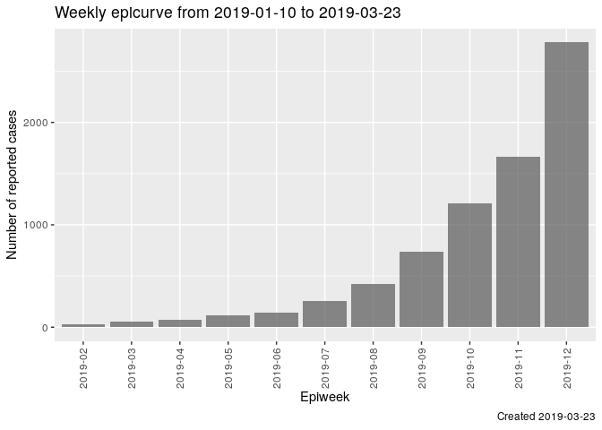
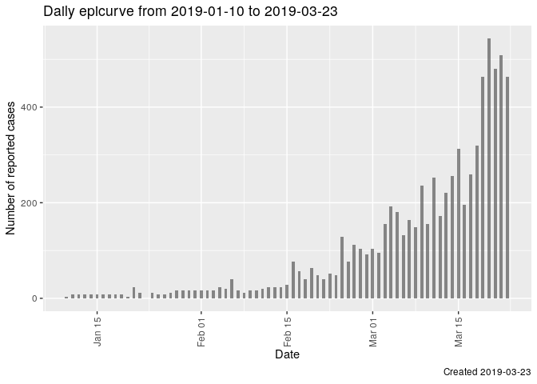
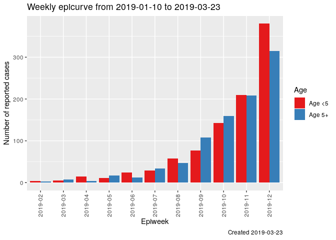
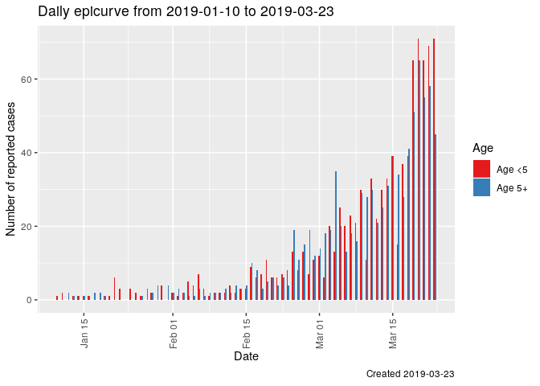
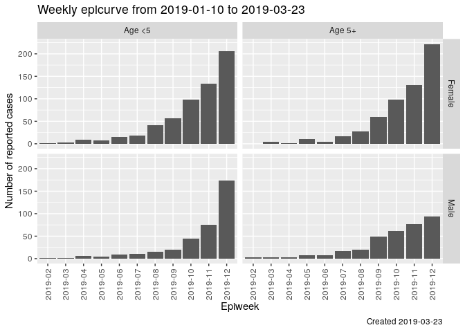
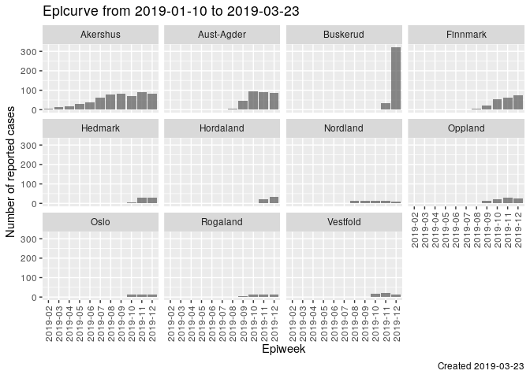
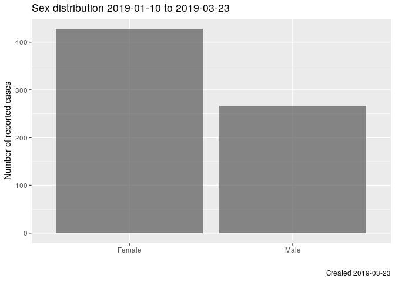
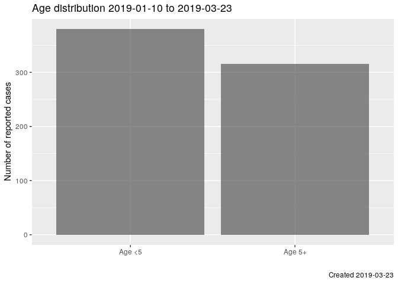
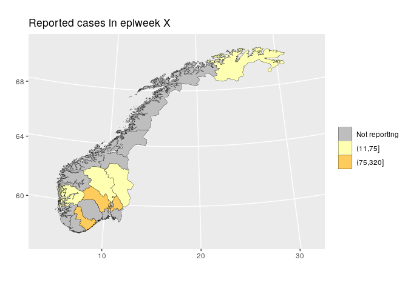
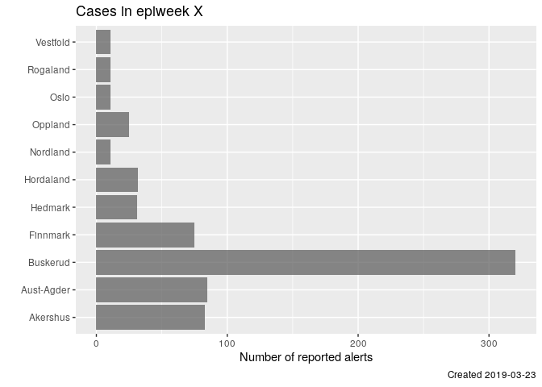

GRAPH TYPES - Epicurves
=======================

Weekly epicurve
---------------

Frontend issue: <https://github.com/IFRCGo/cbs/issues/845>

Backend issue: <https://github.com/IFRCGo/cbs/issues/846>

Chart in Web Template:
`cbs/Documentation/Projects/Analytics/Web Mockup/epicurvebyweek.html`

Chart in React frontend:
`cbs/Source/Analytics/Web/src/components/Epicurvebyweek.js`

Query backend for data: **NOT COMPLETED YET**

Included in dynamic epicurve
(<https://github.com/IFRCGo/cbs/issues/922>): **NOT COMPLETED YET**

Here we display a weekly `epicurve` (the epidemiological term for a time
series graph showing the number of reported cases on the y-axis and time
on the x-axis).

Important to note:

-   We display `year-isoweek` on the x-axis
-   Weeks with zero cases must be displayed

Daily epicurve
--------------

Frontend issue: <https://github.com/IFRCGo/cbs/issues/848>

Backend issue: <https://github.com/IFRCGo/cbs/issues/849>

Chart in Web Template:
`cbs/Documentation/Projects/Analytics/Web Mockup/Epicurvebyday.html`

Chart in React frontend:
`cbs/Source/Analytics/Web/src/components/Epicurvebyday.js`

Query backend for data: **NOT COMPLETED YET**

Included in dynamic epicurve
(<https://github.com/IFRCGo/cbs/issues/922>): **NOT COMPLETED YET**

Here we display a daily `epicurve`.

Important to note:

-   Unclear the best way to display date on the x-axis
-   Days with zero cases must be displayed

Weekly epicurve dodged by age
-----------------------------

Frontend issue: <https://github.com/IFRCGo/cbs/issues/850>

Backend issue: <https://github.com/IFRCGo/cbs/issues/851>

Chart in Web Template:
`cbs/Documentation/Projects/Analytics/Web Mockup/Epicurvebyweekdodgedbyage.html`

Chart in React frontend:
`cbs/Source/Analytics/Web/src/components/Epicurvebyweekdodgedbyage.js`

Query backend for data: **NOT COMPLETED YET**

Included in dynamic epicurve
(<https://github.com/IFRCGo/cbs/issues/922>): **NOT COMPLETED YET**

Here we display a weekly `epicurve` with two columns for each week,
showing the ages side-by-side.

Important to note:

-   We display `year-isoweek` on the x-axis
-   Weeks with zero cases must be displayed

Daily epicurve dodged by age
----------------------------

Frontend issue: <https://github.com/IFRCGo/cbs/issues/852>

Backend issue: <https://github.com/IFRCGo/cbs/issues/853>

Chart in Web Template:
`cbs/Documentation/Projects/Analytics/Web Mockup/epicurvebydaydodgedbyage.html`

Chart in React frontend: **Not generated yet**

Query backend for data: **NOT COMPLETED YET**

Included in dynamic epicurve
(<https://github.com/IFRCGo/cbs/issues/922>): **NOT COMPLETED YET**

Here we display a daily `epicurve` with two columns for each day,
showing the ages side-by-side.

Important to note:

-   Unclear the best way to display date on the x-axis
-   Days with zero cases must be displayed

Weekly epicurves facet\_grid by age/sex
---------------------------------------

Note: The current chart in Web Template has created the graph **dodged**
by age/sex, but we need it to be **facet\_grid** by age/sex. As
mentioned above, this might not be possible in Highcharts and might need
some React trickery to get it working.

Frontend issue: <https://github.com/IFRCGo/cbs/issues/856>

Backend issue: <https://github.com/IFRCGo/cbs/issues/857>

Chart in Web Template:
`cbs/Documentation/Projects/Analytics/Web Mockup/Weeklyepicurvesbyagesex.html`

Chart in React frontend: **NOT COMPLETED YET**

Query backend for data: **NOT COMPLETED YET**

Included in dynamic epicurve
(<https://github.com/IFRCGo/cbs/issues/922>): **NOT COMPLETED YET**

Here we display four weekly epicurves, one for each age/sex combination.

Important to note:

-   We display `year-isoweek` on the x-axis
-   Weeks with zero cases must be displayed
-   Y-axis remains the same height for all panels, to allow for easy
    comparison

Weekly epicurves facet\_wrap by geographical area
-------------------------------------------------

Note: As mentioned above, **facet\_wrap** might not be possible in
Highcharts and might need some React trickery to get it working.

Frontend issue: <https://github.com/IFRCGo/cbs/issues/858>

Backend issue: <https://github.com/IFRCGo/cbs/issues/859>

Chart in Web Template: **NOT COMPLETED YET**

Chart in React frontend: **NOT COMPLETED YET**

Query backend for data: **NOT COMPLETED YET**

Included in dynamic epicurve
(<https://github.com/IFRCGo/cbs/issues/922>): **NOT COMPLETED YET**

Here we display multiple weekly epicurves, one for each geographical
area.

Important to note:

-   We should probably be able to choose the granularity of geographical
    area (region/district/village)
-   We display `year-isoweek` on the x-axis
-   Weeks with zero cases must be displayed
-   Y-axis remains the same height for all panels, to allow for easy
    comparison (this should probably be a toggle?)
-   Very important: We should also implement one version where the
    outcome is:
    `(number of reported cases)/(estimation population)*10000` (i.e.
    number of reported cases per 10.000 population).

GRAPH TYPES - Age and sex distribution over different time frames
=================================================================

Note 1: This is not an epicurve, as the x-axis is not time.

Note 2 (2019-03-21): This has been changed. We now want one barchart
that shows the age distribution, and one barchart that shows the sex
distribution.

Frontend issue: <https://github.com/IFRCGo/cbs/issues/854>

Backend issue: <https://github.com/IFRCGo/cbs/issues/855>

Chart in Web Template:
`cbs/Documentation/Projects/Analytics/Web Mockup/Ageandsexdistributionoverdifferenttimeframes.html`
(needs to be fixed according to Note 2)

Chart in React frontend:
`cbs/Source/Analytics/Web/src/components/AgeAndSexDistribution.js`
(needs to be fixed according to Note 2)

Query backend for data: **NOT COMPLETED YET**

-   We display the number of cases, split by age/sex on the x-axis
-   We need the ability to display different time frames (e.g. per week,
    last week, over multiple weeks)

GRAPH TYPES - Map by geographical area
======================================

Frontend issue: <https://github.com/IFRCGo/cbs/issues/860>

Backend issue: <https://github.com/IFRCGo/cbs/issues/861>

Chart in Web Template:
`cbs/Documentation/Projects/Analytics/Web Mockup/Mapbygeographicalarea.html`

Chart in React frontend: **NOT COMPLETED YET**

Query backend for data: **NOT COMPLETED YET**

Here we display a map with categorized number of cases.

Important to note:

-   We should probably be able to choose the granularity of geographical
    area (region/district/village)
-   We should be able to change the time-frame
-   Not reporting regions should be highlighted
-   The graphing/outcome should be categorical NOT a continuous
    gradient. Probably no more than 4 categories.
-   Very important: We should also implement one version where the
    outcome is:
    `(number of reported cases)/(estimation population)*10000` (i.e.
    number of reported cases per 10.000 population).

GRAPH TYPES - Barcharts by district
===================================

Frontend issue: <https://github.com/IFRCGo/cbs/issues/862>

Backend issue: <https://github.com/IFRCGo/cbs/issues/863>

Chart in Web Template: **NOT COMPLETED YET**

Chart in React frontend: **NOT COMPLETED YET**

Query backend for data: **NOT COMPLETED YET**

This is very similar to the above map, but allows for a more nuanced
view of the numbers.

Important to note:

-   We should probably be able to choose the granularity of geographical
    area (region/district/village)
-   We should be able to change the time-frame
-   The graphing/outcome should be CONTINUOUS
-   Very important: We should also implement one version where the
    outcome is:
    `(number of reported cases)/(estimation population)*10000` (i.e.
    number of reported cases per 10.000 population).

