STATUS
======

-   We have sketched out a number of graphs that we want implemented in
    the frontend
-   These graphs were designed by 'domain experts' and have zero UX
    input (leading to the next point)
-   We have created a static html pages at
    `cbs/Documentation/Projects/Analytics/Web Mockup` where we are
    generating the graphs using Highcharts. A couple are still missing.
    We chose to create this as the React frontend was not yet running
    and we didn't want this to slow down our progress.
-   We have moved 3 of the graphs in the Web Mockup to the React
    frontend.
-   We have created a way of populating MongoDB with test data, see
    [documentation
    here](https://github.com/IFRCGo/cbs/tree/master/Source/Analytics#populating-the-database-with-test-data)
-   The back-end query towards MongoDB have been written for one graph
    (AgeAndSexDistributionAggregationByDateRange).

What needs to be done
---------------------

-   We strongly suspect that these graphs should be presented in some
    sort of dashboard, but due to the lack of UX input/experience we
    have not considered how they should be displayed in a holistic
    manner. We have asked the UX team to provide us with this, and they
    will update
    [UXPin](https://preview.uxpin.com/6f7c2440d8ba5f7888d63932bbc82c4138712847#/pages/101608059/simulate/sitemap)
    with a design.
-   Add the missing charts to the Web Mockup
-   Code the frontend (move the charts from the Web Mockup to the React
    frontend)
-   Code all the backend queries to provide data to the frontend (see
    `Source\Analytics\Read\AgeAndSexDistribution\AgeAndSexDistributionAggregationByDateRange.cs`
    for reference)
-   Link the backend and the frontend (currently, the charts in the
    React frontend are generated from static data in the javascript)
-   Generate the graph based on user input (currently all the graphs are
    simply displayed on the page, the user cannot specify timerange,
    age, sex etc. to display on the graphs). A lot of the epicurves are
    actually just variants on a single graph, so in the future it would
    probably be smart to just make this 1 extremely dynamic graph. We
    are calling this the **dynamic epicurve**
    (<https://github.com/IFRCGo/cbs/issues/922>).
-   Figure out where to extract geographical values (district, region,
    village) from the GPS coordinates. Currently, all the generated
    graphs show all the data (national level).
-   Figure out where to get the population number (today, this does not
    exist in CBS). The graphs do not account for this today.
-   Get 'domain experts' to provide appropriate labels for everything
    (e.g. 'number of reported alerts' instead of 'number of cases')

DEFINITIONS
===========

**Epicurve**

Epicurves is the epidemiological term for a time series graph showing
the number of reported cases on the y-axis and time on the x-axis.

Right now (codeathon 2019-01-19), we are hard coding each epicurve into
its own page. However, in the future, we will make one "Epicurve" page
that has a number of options that allows all possible/desirable
epicurves to be generated on the same page (see:
<https://github.com/IFRCGo/cbs/issues/922>).

We now demonstrate the important definitions:

**facet\_grid**

Here we have a facet\_grid with `x=age` and `y=sex`. We tend to use
facet\_grid when we have a small amount of values to facet on, and we
know how many there will be (e.g. age and sex, maybe health factor).

As far as we know, this is not possible using Highcharts. We might need
to use some React trickery to duplicate multiple Highchart graphs to
recreate this effect.

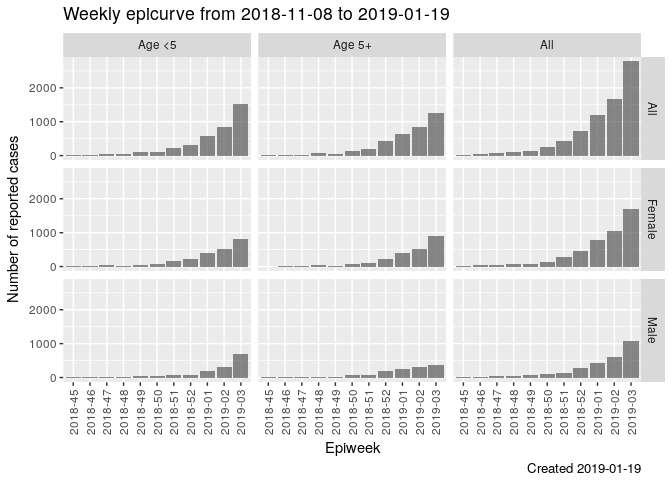

**facet\_wrap**

Here we have a facet\_wrap on `sex`. We use facet\_wrap when there will
be a lot of values to facet on, and we don't know how many there will be
in advance (e.g. geography is a good one).

As far as we know, this is not possible using Highcharts. We might need
to use some React trickery to duplicate multiple Highchart graphs to
recreate this effect.

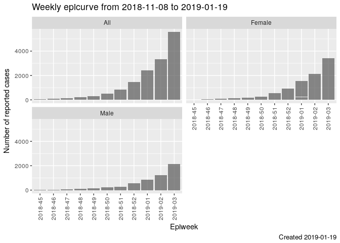

**dodge**

Here we dodge on `sex`. This means we put the values side-by-side in the
same graph (and colour them differently). We dodge when there are a
small amount of values to compare against.

This is definitely possible using Highcharts.

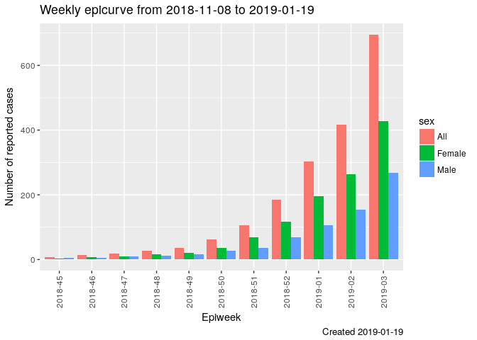

**Dynamic options**

Geography:

Levels (this part will need to be more flexible depending on the
circumstances, but this is a good start):

-   all (i.e. all the data -- national level)
-   district
-   region
-   village

The 'geographical value' is stored in 'geo'. i.e. if `level=district`,
then maybe `geo=Western Norway`. If `level=village` then maybe
`geo=Oslo`.

`Sex` is:

-   All
-   Male
-   Female

`Age` is:

-   All
-   Age &lt;5
-   Age 5+

EPICURVES
=========

Weekly epicurve
---------------

Frontend issue: <https://github.com/IFRCGo/cbs/issues/845>

Backend issue: <https://github.com/IFRCGo/cbs/issues/846>

Chart in Web Template:
`cbs/Documentation/Projects/Analytics/Web Mockup/epicurvebyweek.html`

Chart in React frontend:
`cbs/Source/Analytics/Web/src/components/Epicurvebyweek.js`

Query backend for data: **NOT COMPLETED YET**

Included in dynamic epicurve
(<https://github.com/IFRCGo/cbs/issues/922>): **NOT COMPLETED YET**

Here we display a weekly `epicurve` (the epidemiological term for a time
series graph showing the number of reported cases on the y-axis and time
on the x-axis).

Important to note:

-   We display `year-isoweek` on the x-axis
-   Weeks with zero cases must be displayed

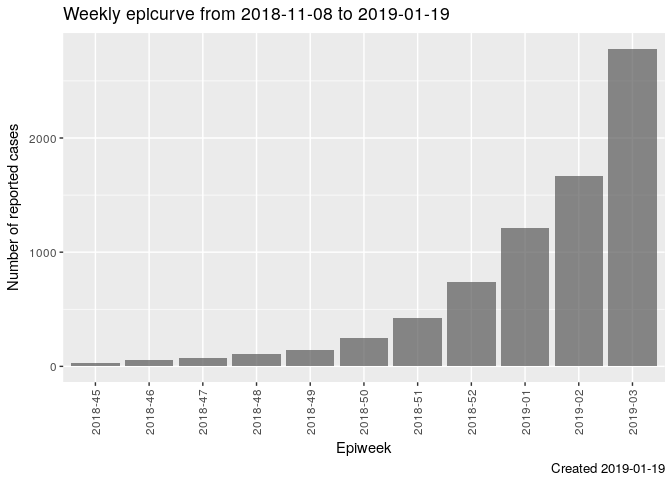

Daily epicurve
--------------

Frontend issue: <https://github.com/IFRCGo/cbs/issues/848>

Backend issue: <https://github.com/IFRCGo/cbs/issues/849>

Chart in Web Template:
`cbs/Documentation/Projects/Analytics/Web Mockup/Epicurvebyday.html`

Chart in React frontend:
`cbs/Source/Analytics/Web/src/components/Epicurvebyday.js`

Query backend for data: **NOT COMPLETED YET**

Included in dynamic epicurve
(<https://github.com/IFRCGo/cbs/issues/922>): **NOT COMPLETED YET**

Here we display a daily `epicurve`.

Important to note:

-   Unclear the best way to display date on the x-axis
-   Days with zero cases must be displayed

Weekly epicurve dodged by age
-----------------------------

Frontend issue: <https://github.com/IFRCGo/cbs/issues/850>

Backend issue: <https://github.com/IFRCGo/cbs/issues/851>

Chart in Web Template:
`cbs/Documentation/Projects/Analytics/Web Mockup/Epicurvebyweekdodgedbyage.html`

Chart in React frontend:
`cbs/Source/Analytics/Web/src/components/Epicurvebyweekdodgedbyage.js`

Query backend for data: **NOT COMPLETED YET**

Included in dynamic epicurve
(<https://github.com/IFRCGo/cbs/issues/922>): **NOT COMPLETED YET**

Here we display a weekly `epicurve` with two columns for each week,
showing the ages side-by-side.

Important to note:

-   We display `year-isoweek` on the x-axis
-   Weeks with zero cases must be displayed

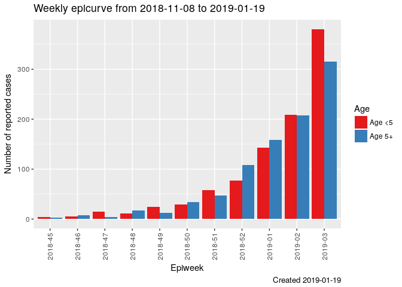

Daily epicurve dodged by age
----------------------------

Frontend issue: <https://github.com/IFRCGo/cbs/issues/852>

Backend issue: <https://github.com/IFRCGo/cbs/issues/853>

Chart in Web Template: **Not generated yet**

Chart in React frontend: **Not generated yet**

Query backend for data: **NOT COMPLETED YET**

Included in dynamic epicurve
(<https://github.com/IFRCGo/cbs/issues/922>): **NOT COMPLETED YET**

Here we display a daily `epicurve` with two columns for each day,
showing the ages side-by-side.

Important to note:

-   Unclear the best way to display date on the x-axis
-   Days with zero cases must be displayed

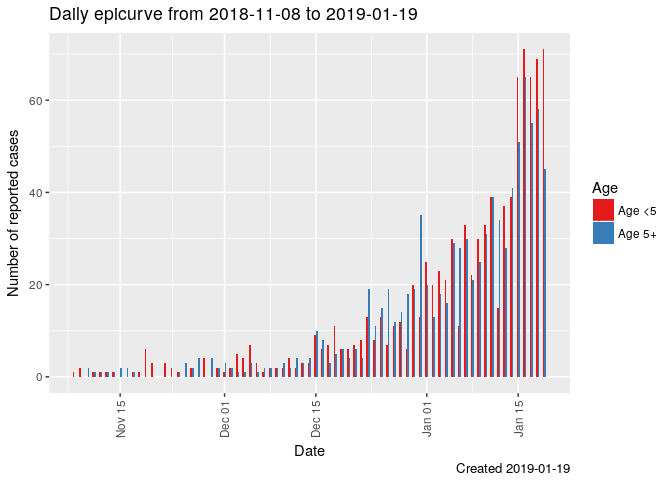

Weekly epicurves facet\_grid by age/sex
---------------------------------------

Note: The current chart in Web Template has created the graph **dodged**
by age/sex, but we need it to be **facet\_grid** by age/sex. As
mentioned above, this might not be possible in Highcharts and might need
some React trickery to get it working.

Frontend issue: <https://github.com/IFRCGo/cbs/issues/856>

Backend issue: <https://github.com/IFRCGo/cbs/issues/857>

Chart in Web Template:
`cbs/Documentation/Projects/Analytics/Web Mockup/Weeklyepicurvesbyagesex.html`

Chart in React frontend: **NOT COMPLETED YET**

Query backend for data: **NOT COMPLETED YET**

Included in dynamic epicurve
(<https://github.com/IFRCGo/cbs/issues/922>): **NOT COMPLETED YET**

Here we display four weekly epicurves, one for each age/sex combination.

Important to note:

-   We display `year-isoweek` on the x-axis
-   Weeks with zero cases must be displayed
-   Y-axis remains the same height for all panels, to allow for easy
    comparison

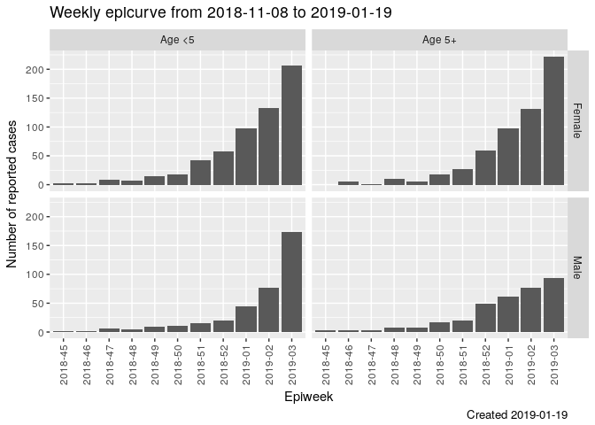

Weekly epicurves facet\_wrap by geographical area
-------------------------------------------------

Note: As mentioned above, **facet\_wrap** might not be possible in
Highcharts and might need some React trickery to get it working.

Frontend issue: <https://github.com/IFRCGo/cbs/issues/858>

Backend issue: <https://github.com/IFRCGo/cbs/issues/859>

Chart in Web Template: **NOT COMPLETED YET**

Chart in React frontend: **NOT COMPLETED YET**

Query backend for data: **NOT COMPLETED YET**

Included in dynamic epicurve
(<https://github.com/IFRCGo/cbs/issues/922>): **NOT COMPLETED YET**

Here we display multiple weekly epicurves, one for each geographical
area.

Important to note:

-   We should probably be able to choose the granularity of geographical
    area (region/district/village)
-   We display `year-isoweek` on the x-axis
-   Weeks with zero cases must be displayed
-   Y-axis remains the same height for all panels, to allow for easy
    comparison (this should probably be a toggle?)
-   Very important: We should also implement one version where the
    outcome is:
    `(number of reported cases)/(estimation population)*10000` (i.e.
    number of reported cases per 10.000 population).

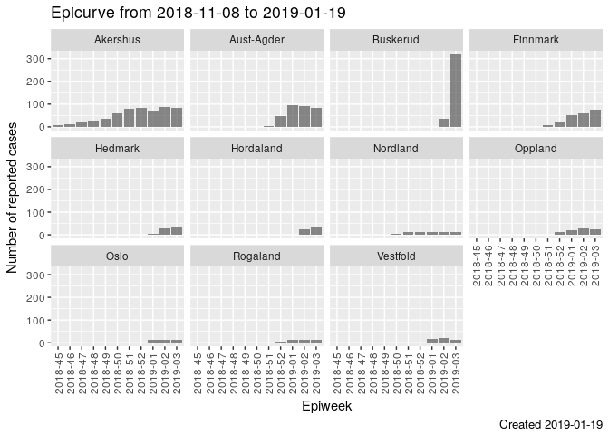

Age and sex distribution over different time frames
===================================================

Note: This is not an epicurve, as the x-axis is not time.

Frontend issue: <https://github.com/IFRCGo/cbs/issues/854>

Backend issue: <https://github.com/IFRCGo/cbs/issues/855>

Chart in Web Template:
`cbs/Documentation/Projects/Analytics/Web Mockup/Ageandsexdistributionoverdifferenttimeframes.html`

Chart in React frontend: **NOT COMPLETED YET**

Query backend for data: **NOT COMPLETED YET**

-   We display the number of cases, split by age/sex on the x-axis
-   We need the ability to display different time frames (e.g. per week,
    last week, over multiple weeks)

Map by geographical area
========================

Frontend issue: <https://github.com/IFRCGo/cbs/issues/860>

Backend issue: <https://github.com/IFRCGo/cbs/issues/861>

Chart in Web Template:
`cbs/Documentation/Projects/Analytics/Web Mockup/Mapbygeographicalarea.html`

Chart in React frontend: **NOT COMPLETED YET**

Query backend for data: **NOT COMPLETED YET**

Here we display a map with categorized number of cases.

Important to note:

-   We should probably be able to choose the granularity of geographical
    area (region/district/village)
-   We should be able to change the time-frame
-   Not reporting regions should be highlighted
-   The graphing/outcome should be categorical NOT a continuous
    gradient. Probably no more than 4 categories.
-   Very important: We should also implement one version where the
    outcome is:
    `(number of reported cases)/(estimation population)*10000` (i.e.
    number of reported cases per 10.000 population).

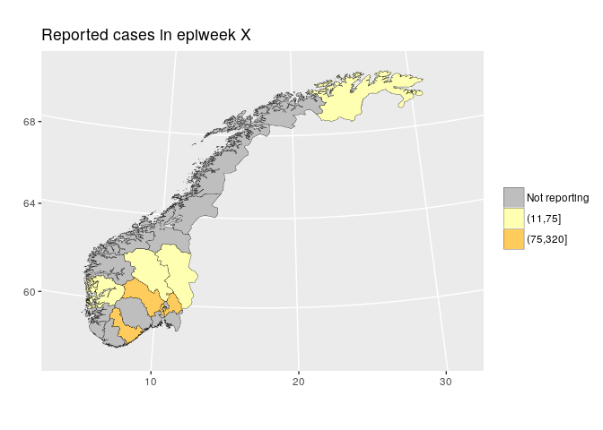

Barcharts by district
=====================

Frontend issue: <https://github.com/IFRCGo/cbs/issues/862>

Backend issue: <https://github.com/IFRCGo/cbs/issues/863>

Chart in Web Template: **NOT COMPLETED YET**

Chart in React frontend: **NOT COMPLETED YET**

Query backend for data: **NOT COMPLETED YET**

This is very similar to the above map, but allows for a more nuanced
view of the numbers.

Important to note:

-   We should probably be able to choose the granularity of geographical
    area (region/district/village)
-   We should be able to change the time-frame
-   The graphing/outcome should be CONTINUOUS
-   Very important: We should also implement one version where the
    outcome is:
    `(number of reported cases)/(estimation population)*10000` (i.e.
    number of reported cases per 10.000 population).

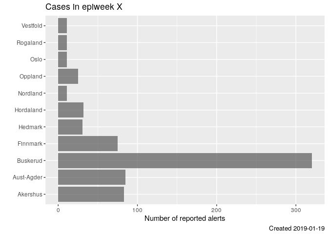

VOLUNTEER INFORMATION
=====================

The previous graphs have been about health risks. We also need
information about the volunteers.

Aggregate information (basic)
-----------------------------

We require a table with each row corresponding to a particular
geographical region (granularity of geographical level will need to be
specified), and two columns:

-   How many volunteers are active
-   How many volunteers are registered

So for example, if granularity is "national" then we would expect only 1
row. If granularity is "district" then we would have 1 row per district.

Individual level information (complicated)
------------------------------------------

We require a table with each row corresponding to an individual
volunteer and multiple columns:

-   Name
-   Location
-   How long they have been engaged
-   Number of days since last report
-   Has reported in the last 0-7 days? \[colored box, blue if yes, red
    if no\]
-   Has reported in the last 8-14 days? \[colored box, blue if yes, red
    if no\]
-   Has reported in the last 15-21 days? \[colored box, blue if yes, red
    if no\]
-   Has reported in the last 22-28 days? \[colored box, blue if yes, red
    if no\]
-   Has reported in the last 29-35 days? \[colored box, blue if yes, red
    if no\]
-   Has reported in the last 36-42 days? \[colored box, blue if yes, red
    if no\]

Note: The 0-7, 8-14, etc numbers are for a weekly example. There will
need to be the option to specify "daily", "weekly", or "monthly".

This table will be linked to a map where the GPS coordinates of each of
the volunteers is displayed. It will be possible to select individuals
using the map, and these selected individuals will then be highlighted
in the above table.

Program statistics
------------------

Is it possible to display this information as summary program
statistics?

-   Number of volunteers
-   % of Red Cross volunteers active the last 30(XX) days
-   Number of trained volunteers / total sum of volunteers
-   Number of active volunteers the last 30 days
-   Number of Red Cross volunteers trained by moths
-   Above information displayed by Age/ sex

District/Person reporting funnel plot A
---------------------------------------

NOTE: THIS SECTION HAS BEEN DOWNGRADED IN PRIORITY. FOR THE MOMENT, DO
NOT IMPLEMENT.

Frontend issue: <https://github.com/IFRCGo/cbs/issues/869>

Backend issue: <https://github.com/IFRCGo/cbs/issues/870>

Chart in Web Template: **NOT COMPLETED YET**

Chart in React frontend: **NOT COMPLETED YET**

Query backend for data: **NOT COMPLETED YET**

The idea of this funnel plot is to identify districts/people who are
reporting worse than expected.

For each month, we count the number of messages sent, and the number of
correctly sent messages. From this, we generate an "expected proportion
of received messages that are correct" (e.g. 80%). Then, for i = 1, ...,
100 (or higher, as necessary) we calculate the 2.5th and 97.5th
percentiles according to the binomial distribution. That is, (e.g. for
i=40) what is the 2.5th and 97.5th percentile of a Binom(n=40, p=0.8)
distribution. These percentiles are our boundaries as displayed in the
graph.

Important to note:

-   We should be able to switch between district/people/other grouping
    measure
-   We should be able to change the time-frame
-   Maybe only the people/groups who are "lower than expected" should be
    highlighted in some way?

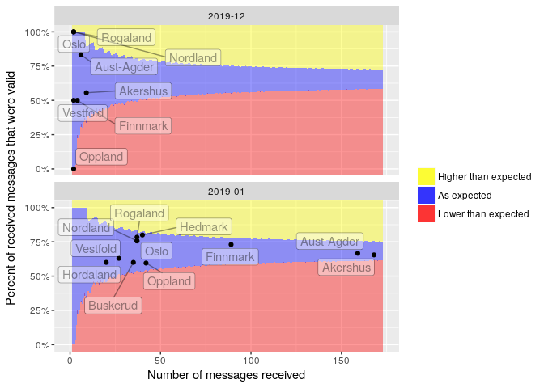

District/Person reporting funnel plot B
---------------------------------------

NOTE: THIS SECTION HAS BEEN DOWNGRADED IN PRIORITY. FOR THE MOMENT, DO
NOT IMPLEMENT.

Frontend issue: <https://github.com/IFRCGo/cbs/issues/871>

Backend issue: <https://github.com/IFRCGo/cbs/issues/872>

Chart in Web Template: **NOT COMPLETED YET**

Chart in React frontend: **NOT COMPLETED YET**

Query backend for data: **NOT COMPLETED YET**

The idea of this funnel plot is to identify districts/people who are
reporting worse than expected.

For each month, we count the number of messages sent, and the number of
correctly sent messages. From this, we generate an "expected proportion
of received messages that are correct" (e.g. 80%). Then, for each
district/person, we calculate the 2.5th and 97.5th percentiles according
to the binomial distribution. That is, (e.g. if Oslo sent 40 messages)
what is the 2.5th and 97.5th percentile of a Binom(n=40, p=0.8)
distribution. These percentiles are our boundaries as displayed in the
graph.

Important to note:

-   We should be able to switch between district/people/other grouping
    measure
-   We should be able to change the time-frame
-   Maybe only the people/groups who are "lower than expected" should be
    highlighted in some way?

<!-- -->

    ## Warning: Removed 10 rows containing missing values (geom_linerange).

    ## Warning: Removed 10 rows containing missing values (geom_linerange).

    ## Warning: Removed 10 rows containing missing values (geom_linerange).

    ## Warning: Removed 10 rows containing missing values (geom_point).

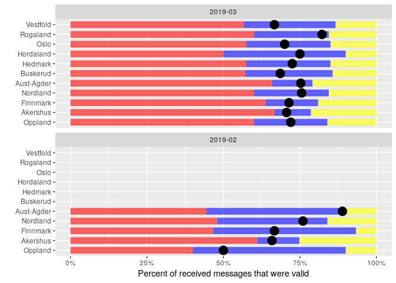
