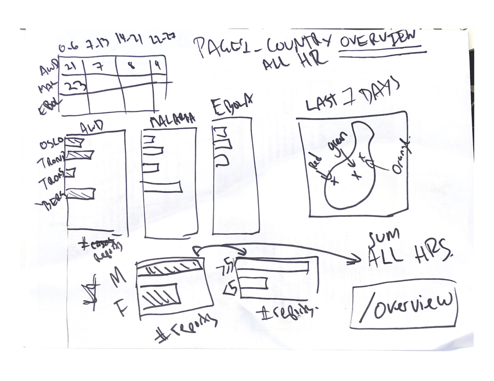
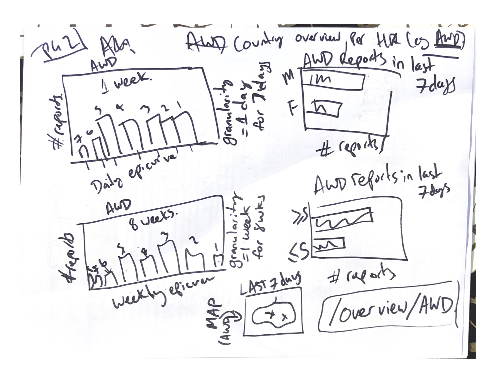
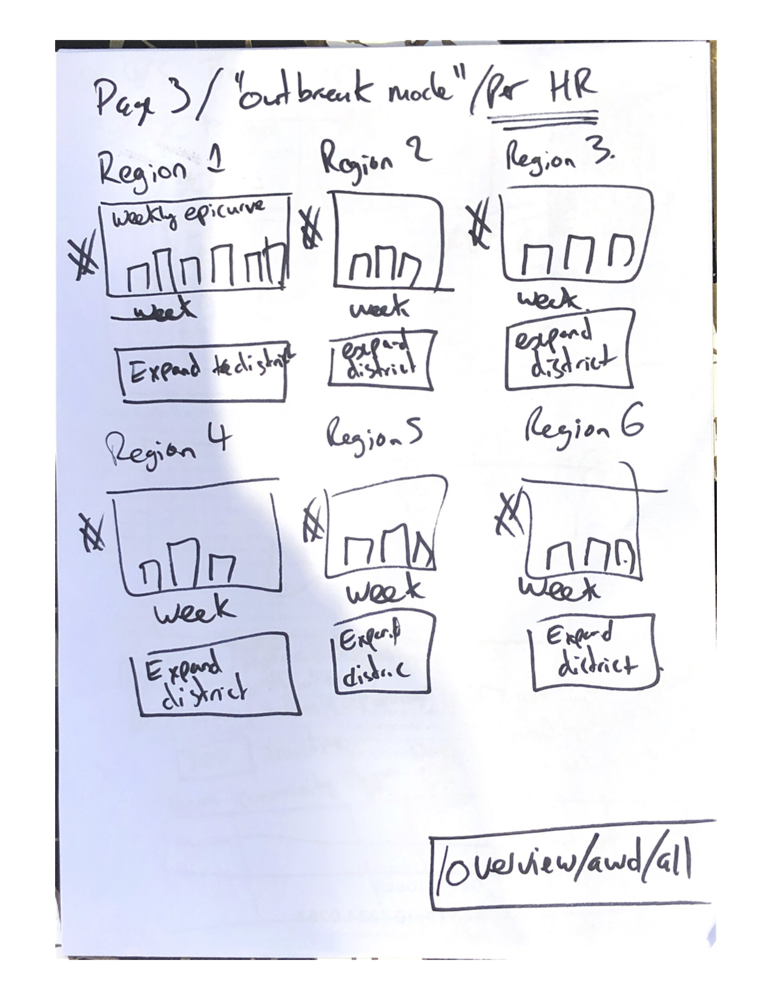
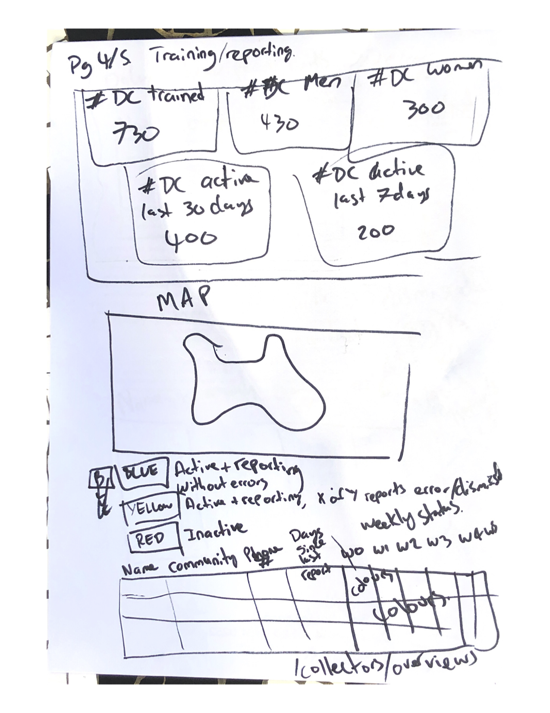
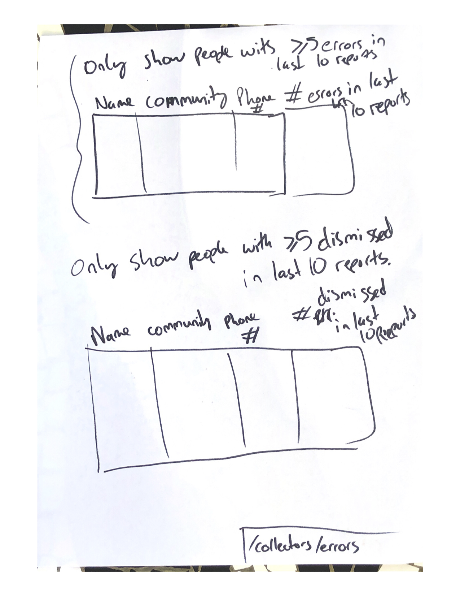
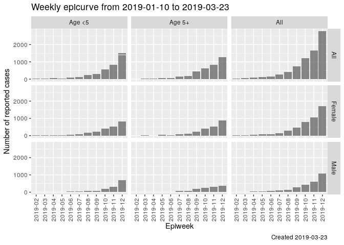
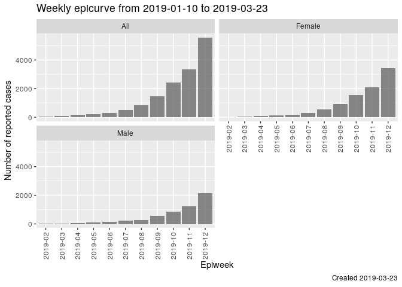
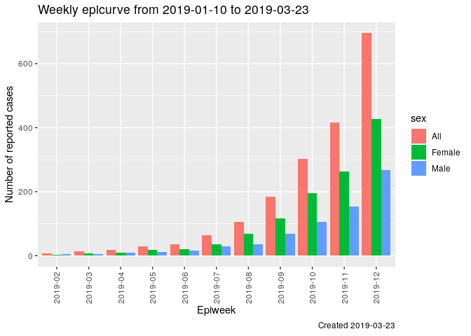

STATUS
======

-   (OLD) We have sketched out a number of graphs that we want implemented in
    the frontend
-   (OLD) These graphs were designed by 'domain experts' and have zero UX
    input (leading to the next point)
-   (OLD) We have created a static html pages at
    `cbs/Documentation/Projects/Analytics/Web Mockup` where we are
    generating the graphs using Highcharts. A couple are still missing.
    We chose to create this as the React frontend was not yet running
    and we didn't want this to slow down our progress.
-   (OLD) We have moved a number of the graphs in the Web Mockup to the React
    frontend.
-   (OLD) We have created a way of populating MongoDB with test data, see
    [documentation
    here](https://github.com/IFRCGo/cbs/tree/master/Source/Analytics#populating-the-database-with-test-data)
-   (OLD) The back-end query towards MongoDB have been written for one graph
    (AgeAndSexDistributionAggregationByDateRange).
-   (2019-03-21) We have decided on which graphs/tables should be put in
    which pages. This is under the section `PAGES OF MULTIPLE GRAPHS`
- (2019-04-10) We have a react frontend displaying epidemiological data via charts and maps, and other indicators, but NOT according to the below specifications
- (2019-04-10) We have a backend API for retrieving case reports (aggregated on sex, age, and specifying time frame - daily/weekly) and data collector information.

Reference pages
---------------------

[UXPin Page 1](https://preview.uxpin.com/6f7c2440d8ba5f7888d63932bbc82c4138712847#/pages/109294637/simulate/sitemap)
[UXPin Page 2](https://preview.uxpin.com/6f7c2440d8ba5f7888d63932bbc82c4138712847#/pages/109325305/simulate/sitemap)
[UXPin Page 3](https://preview.uxpin.com/6f7c2440d8ba5f7888d63932bbc82c4138712847#/pages/109327655/simulate/sitemap)

[graphs.md highlights a number of older graphs that can be used as reference and inspiration](graphs.md)

[archive.md contains non-relevant information that is kept for historical reference](archive.md)

What needs to be done
---------------------

In general/high priority:

- Start with a new blank page and try to create pages 1, 2, and 3 (section `PAGES OF MULTIPLE GRAPHS`), using the current frontend (that is misspecified)

Suggested working order
-----------------------

1.  Look at the section `PAGES OF MULTIPLE GRAPHS`
2.  Select a page
3.  Select a graph/table on that page
4.  Make it work!

Note that `PAGE 3 - Outbreak mode, per health risk ("Analytics 13")` is
the easiest page.

PAGES OF MULTIPLE GRAPHS
========================

Here we will list the contents of various pages.

In general, we cannot show too much information at once. For example, it
is difficult to show multiple weeks of data, for multiple geographical
areas, for multiple health risks. It is much easier (and cleaner!) to
show 1 week of data, for 1 geographical area, for multiple health risks.

CLASSICAL DESCRIPTIVE STATISTICS
--------------------------------

PAGE 1 - Country overview, all health risks ("Analytics 3")
-----------------------------------------------------------

[UXPin Page 1](https://preview.uxpin.com/6f7c2440d8ba5f7888d63932bbc82c4138712847#/pages/109294637/simulate/sitemap)

This page is designed to show an overview of the country **right now**.

We will show:

-   Fixed/limited time periods
-   Fixed/limited geographical areas
-   All of the health risks

This will be done through:

-   A table containing the number of case reports in the last 0-6, 7-13,
    14-21, 22-27 days (columns) for each health risk (rows) for the
    whole country
-   For each health risk, display a separate barchar containing the
    number of case reports per district over the last 7 days. Reference:
    `GRAPH TYPES - Barcharts by district`
-   Display the number of case reports per gender over the last 7 days.
    Total number over all health risks, whole country. Bar chart.
    Reference:
    `GRAPH TYPES - Age and sex distribution over different time frames`
-   Display the number of case reports per age group over the last 7
    days (over/under 5 years old). Total number over all health risks,
    whole country. Bar chart. Reference:
    `GRAPH TYPES - Age and sex distribution over different time frames`
-   Display each case report over the last 7 days on a map by marking
    the position on the map for the Data collector who sent the report,
    with different color for different health risks

PAGE 2 - Country overview, per health risk ("Analytics 4")
----------------------------------------------------------

[UXPin Page 2](https://preview.uxpin.com/6f7c2440d8ba5f7888d63932bbc82c4138712847#/pages/109325305/simulate/sitemap)

This page is designed to show an overview of the country according to a
specific health risk.

We will show:

-   Multiple time periods (i.e. trend over time)
-   Fixed/limited geographical areas
-   One health risk

This will be done through:

-   Daily epicurve for last week with different colors in the bars per
    community, but only up to 5 communities. If there are case reports
    from more than 5 communities last week, display per district instead
    or just have the total over all communities. Reference:
    `GRAPH TYPES - Epicurves/Daily epicurve`
-   Weekly epicurve for last 8 weeks. Reference:
    `GRAPH TYPES - Epicurves/Weekly epicurve`
-   Display the number of case reports per gender over the last 7 days
    (bar graph). Reference:
    `GRAPH TYPES - Age and sex distribution over different time frames`
-   Display the number of case reports per age group over the last 7
    days (over/under 5 years old) (bar graph). Reference:
    `GRAPH TYPES - Age and sex distribution over different time frames`
-   Display each case report over the last 7 days on a map by marking
    the position on the map for the Data collector who sent the report,
    with different color for different health risks

PAGE 3 - Outbreak mode, per health risk ("Analytics 13")
--------------------------------------------------------

[UXPin Page 3](https://preview.uxpin.com/6f7c2440d8ba5f7888d63932bbc82c4138712847#/pages/109327655/simulate/sitemap)

This page is designed to show weekly epicurves (according to a specific
health risk) for:

1.  every region and
2.  every district and
3.  every community that has reported in the last 4 weeks.

This is just a straight out long list of weekly epicurves (one on top of
each other, scrolling down a very long page).

We have also considered that each part could be collapsable. So, for
example, when you first open the page you would see a list of regional
epicurves. Under each regional epicurve you would then have the option
to "expand" and see the district epicurves for that region. Under each
district epicurve you would have the option to "expand" and see the
communities under that district that have reported in the last 4 weeks.

Reference: `GRAPH TYPES - Epicurves/Weekly epicurve`

INFORMATION ON DATA COLLECTORS
------------------------------

PAGE 4 - Training/reporting ("Analytics 7") & Location and status ("Analytics 8/9")
-------------------------------------------

NOTE: DO NOT IMPLEMENT NOW. WAITING UNTIL REPORTING IS DONE.

In a table:

-   Display number of Data collectors trained in total (number of Data
    collectors currently in CBS for the national society)
-   Display how many Data collectors have been active last 7 days
    (active if case report or activity report was send by the user last
    7 days)
-   Display how many Data collectors have been active last 30 days
    (active if case report or activity report was send by the user last
    30 days)
-   Display the number of male/female Data collectors trained in total

Please reference the section
`VOLUNTEER INFORMATION - Individual level information (complicated)` for
inspiration.

A map containing:

-   Display each Data collectors GPS position (as registered on the Data
    collectors profile information)
-   Mark each Data collectors position on the map where the mark has
    different colors based on the Data collector status:
    -   Blue if active and reporting without errors
    -   Yellow if active and reporting, but x out of y last reports were
        in error or dismissed
    -   Red if inactive (no case or activity reports sent for more than
        7 days)
-   Click the Data collectors position on the map to see Data collector
    info (linked to the table below).

In a table, for each Data collector, display:

-   Name
-   Location (Village, but call it Community)
-   Phone number
-   days since last report (case or activity report)
-   Weekly status over the last 8 weeks. Have a color coded
    mark/indicator per week:
    -   Blue if active and reporting without errors
    -   Yellow if active and reporting, but one or more of the reports
        that week where in error or dismissed
    -   Red if inactive (no case or activity reports sent that week)
-   Supervisors can only see Data collectors they supervise, not Data
    collectors supervised by other Supervisors. Data owner sees all

PAGE 5 - Errors ("Analytics 10")
--------------------------------

NOTE: DO NOT IMPLEMENT NOW. WAITING UNTIL REPORTING IS DONE.

-   Display a table with Data collectors often sending reports with
    errors: If 5 of the last 10 (?) reports from a Data collector had
    errors it's displayed in this table
-   Display a table with Data collectors often sending reports that are
    being dismissed: If 5 of the last 10 (?) reports from a Data
    collector were dismissed it's displayed in this table
-   Supervisors can only see Data collectors they supervise, not Data
    collectors supervised by other Supervisors. Data owner sees all

INFORMATION ON ALERTS
---------------------

PAGE 6 - ("Analytics 11/12")
----------------------------

NOTE: DO NOT IMPLEMENT NOW. WAITING UNTIL ALERTS IS DONE.

-   Display how many alerts have been triggered in total, how many was
    escalated and how many were dismissed

-   Display a table, where each week is a column and each community is a
    row (only display communities that have had an alert in the last 8
    weeks). Each week (cell in the table) has a color to indicate
    status:
    -   blue (no open/ongoing alert)
    -   red (at least one open/ongoing alert)
    -   black (zero open/ongoing alerts and &gt;=1 closed alerts)
-   So if fex an alert for community A was triggered in week 3 and
    closed in week 7, then week 1 and 2 is blue, 3 is red (when looking
    at the dashboard before week7) and black (when looking at the
    dashboard after week7) and weeks 4-8 are blue

-   Can click on a red/black cell and get alert details for the
    week/community (see next points)
-   See the status and health risk for the alert. Status can be Open,
    Escalated, Dismissed or Closed.
-   See all reports linked to the alert. For each report, see
    -   Date when the report was sent
    -   Location (Village)
    -   Data collector name/number
    -   Supervisor of the Data collector who sent the report
    -   Report assessment (Kept, Dismissed or Not assessed)

DEFINITIONS
===========

**Epicurve**

Epicurves is the epidemiological term for a time series graph showing
the number of reported cases on the y-axis and time on the x-axis.

**facet\_grid**

Here we have a facet\_grid with `x=age` and `y=sex`. We tend to use
facet\_grid when we have a small amount of values to facet on, and we
know how many there will be (e.g. age and sex, maybe health factor).

This is how to do it via Highcharts:
<https://www.highcharts.com/blog/post/why-and-how-to-split-one-chart-into-a-grid-of-charts-aka-small-multiple/>

**facet\_wrap**

Here we have a facet\_wrap on `sex`. We use facet\_wrap when there will
be a lot of values to facet on, and we don't know how many there will be
in advance (e.g. geography is a good one).

This is how to do it via Highcharts:
<https://www.highcharts.com/blog/post/why-and-how-to-split-one-chart-into-a-grid-of-charts-aka-small-multiple/>

**dodge**

Here we dodge on `sex`. This means we put the values side-by-side in the
same graph (and colour them differently). We dodge when there are a
small amount of values to compare against.

This is definitely possible using Highcharts.

