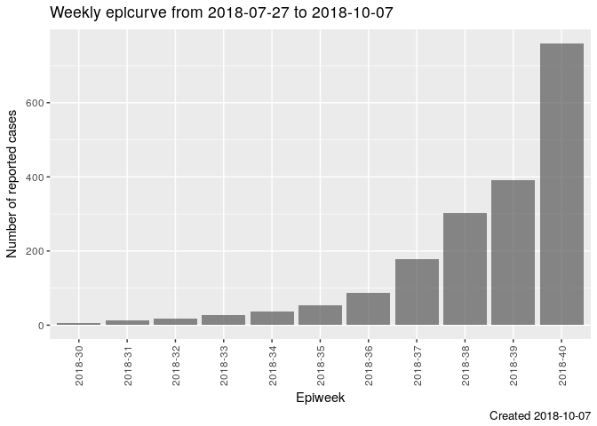
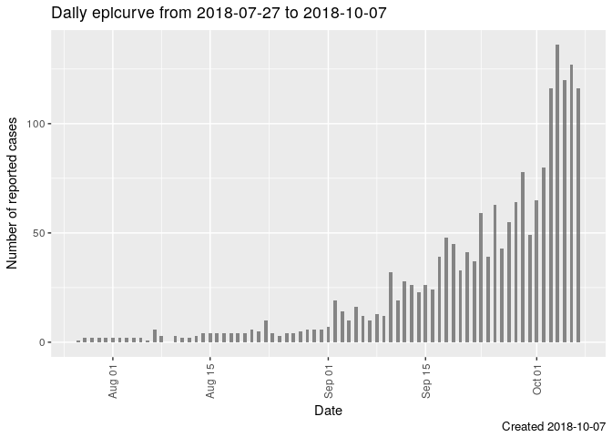
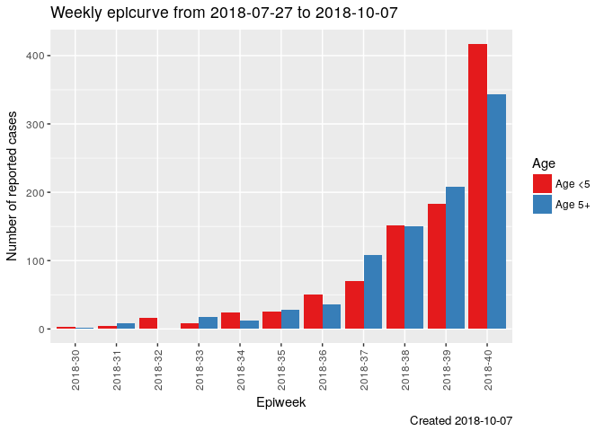
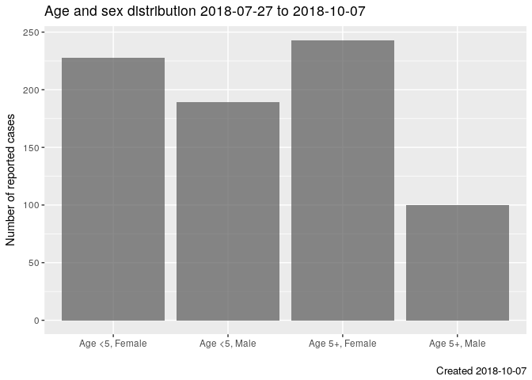
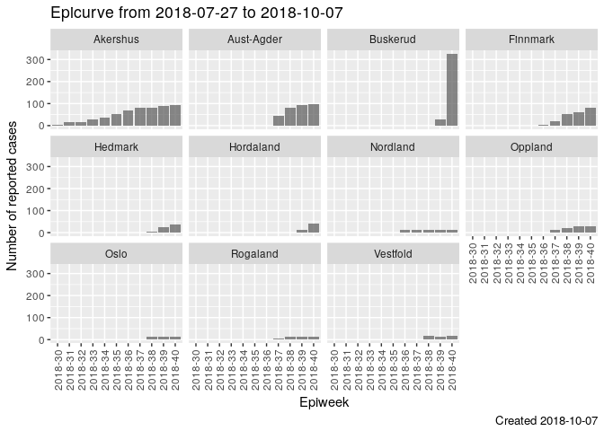
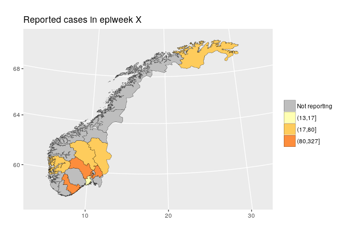
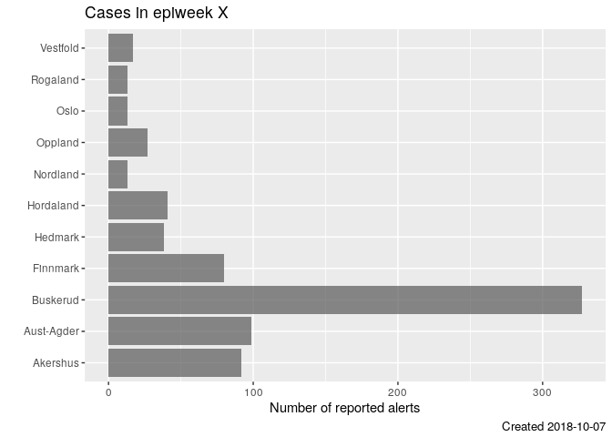

Introduction
------------

This bounded context is supposed to be a "high level explanation of what
is happening on the ground". Think along the lines of national
societies.

The overriding questions that we want to answer are:

-   Who (...is sick - male/female, children/adults?)
-   What (...are the illnesses of most concern)
-   Where (...are people getting sick)
-   When (is the danger starting/increasing/decreasing/over?)

Project view
------------

https://github.com/IFRCGo/cbs/projects/5

Technology
----------

It has been decided that React will be used for the frontend, and D3
will be used to create the graphs/dashboards.

The React frontend is prototyped by `VolunteerReporting` and we just copy what they do.

Fake data (.xlsx) and R
-----------------

`cbs/Documentation/Projects/Analytics/fakedata` contains `report.Rmd` that reads in the fake data (data/*.xlsx) and produces a number of graphs that we want to be included in the cbs system. If you like R, you can use this `report.Rmd` file to prototype and test out new possible graphs.

Fake data (.json)
-----------------

`cbs/Documentation/Projects/Analytics/fakejson` contains a lot of fake .json datafiles that are to be used for prototyping the D3 graphs.

What has been done
------

- We have sketched out a number of graphs that we want implemented in the frontend
- These graphs were designed by 'domain experts' and have zero UX input (leading to the next point)
- Fake data (.json) is provided at `cbs/Documentation/Projects/Analytics/fakejson` for some of these graphs
- The back-end queries have been written for one graph, but we can't get it to work

What needs to be done
----------------

- We strongly suspect that these graphs should be presented in some sort of dashboard, but due to the lack of UX input/experience we have not considered how they should be displayed in a holistic manner
- Code all the back end queries to provide data to the front-end
- Code the front end
- Link the back and the front end

Epicurve by week
----------------

Frontend issue: https://github.com/IFRCGo/cbs/issues/845
Backend issue: https://github.com/IFRCGo/cbs/issues/846
Fake json data: `cbs/Documentation/Projects/Analytics/fakejson/epicurve-by-week.json`

This fake json data file has 4 'levels':

- all (i.e. all the data -- national level)
- district
- region
- village

The 'geographical value' is stored in 'geo'. i.e. if `level=district`, then maybe `geo=Western Norway`. If `level=village` then maybe `geo=Oslo`.

`Sex` is:

- All
- Male
- Female

`Age` is:

- All
- Age <5
- Age 5+

`pop` contains the population if it exists. Otherwise it is -9.

Here we display a weekly `epicurve` (the epidemiological term for a time
series graph showing the number of reported cases on the y-axis and time
on the x-axis).

Important to note:

-   We display `year-isoweek` on the x-axis
-   Weeks with zero cases must be displayed

There is fake json data available at `cbs/Source/Analytics/Web.React/src/assets/data/epicurve_by_week.json`.

We have also implemented a back-end query to provide data for this, but it does not work. 

We also tried to implement a simple D3 graph as a skeleton example for linking the back and front end (`cbs/Source/Analytics/Web.React/src/components/Epicurve.js`) but this has not been completed as we couldn't get the back-end query to work.

Epicurve by day
---------------

Frontend issue: https://github.com/IFRCGo/cbs/issues/848
Backend issue: https://github.com/IFRCGo/cbs/issues/849
Fake json data: `cbs/Documentation/Projects/Analytics/fakejson/epicurve-by-day.json`

This fake json data file has 4 'levels':

- all (i.e. all the data -- national level)
- district
- region
- village

The 'geographical value' is stored in 'geo'. i.e. if `level=district`, then maybe `geo=Western Norway`. If `level=village` then maybe `geo=Oslo`.

`Sex` is:

- All
- Male
- Female

`Age` is:

- All
- Age <5
- Age 5+

`pop` contains the population if it exists. Otherwise it is -9.

Here we display a daily `epicurve`.

Important to note:

-   Unclear the best way to display date on the x-axis
-   Days with zero cases must be displayed

Epicurve by week dodged by age
------------------------------

Frontend issue: https://github.com/IFRCGo/cbs/issues/850
Backend issue: https://github.com/IFRCGo/cbs/issues/851
Fake json data: `cbs/Documentation/Projects/Analytics/fakejson/epicurve-by-week.json`

This is an extension of the graph Epicurve by week" (frontend issue: https://github.com/IFRCGo/cbs/issues/845, backend issue: https://github.com/IFRCGo/cbs/issues/846).

Here we display a weekly `epicurve` with two columns for each week,
showing the ages side-by-side.

Important to note:

-   We display `year-isoweek` on the x-axis
-   Weeks with zero cases must be displayed

Epicurve by day dodged by age
-----------------------------

Frontend issue: https://github.com/IFRCGo/cbs/issues/852
Backend issue: https://github.com/IFRCGo/cbs/issues/853
Fake json data: `cbs/Documentation/Projects/Analytics/fakejson/epicurve-by-day.json`

This is an extension of the graph Epicurve by day" (frontend issue: https://github.com/IFRCGo/cbs/issues/848, backend issue: https://github.com/IFRCGo/cbs/issues/849).

Here we display a daily `epicurve` with two columns for each day,
showing the ages side-by-side.

Important to note:

-   Unclear the best way to display date on the x-axis
-   Days with zero cases must be displayed

Age and sex distribution over different time frames
---------------------------------------------------

Frontend issue: https://github.com/IFRCGo/cbs/issues/854
Backend issue: https://github.com/IFRCGo/cbs/issues/855
Fake json data: `cbs/Documentation/Projects/Analytics/fakejson/epicurve-by-week.json`

-   We display the number of cases, split by age/sex on the x-axis
-   We need the ability to display different time frames (e.g. per week,
    last week, over multiple weeks)
-   We need to display over different geographical regions as well

Weekly epicurves by age/sex
---------------------------

Frontend issue: https://github.com/IFRCGo/cbs/issues/856
Backend issue: https://github.com/IFRCGo/cbs/issues/857
Fake json data: `cbs/Documentation/Projects/Analytics/fakejson/epicurve-by-week.json`

This is an extension of the graph Epicurve by week" (frontend issue: https://github.com/IFRCGo/cbs/issues/845, backend issue: https://github.com/IFRCGo/cbs/issues/846).

Here we display four weekly epicurves, one for each age/sex combination.

Important to note:

-   We display `year-isoweek` on the x-axis
-   Weeks with zero cases must be displayed
-   Y-axis remains the same height for all panels, to allow for easy
    comparison

Weekly epicurves by geographical area
-------------------------------------

Frontend issue: https://github.com/IFRCGo/cbs/issues/858
Backend issue: https://github.com/IFRCGo/cbs/issues/859
Fake json data: `cbs/Documentation/Projects/Analytics/fakejson/epicurve-by-week.json`

This is an extension of the graph Epicurve by week" (frontend issue: https://github.com/IFRCGo/cbs/issues/845, backend issue: https://github.com/IFRCGo/cbs/issues/846).

Here we display multiple weekly epicurves, one for each geographical
area.

Important to note:

-   We should probably be able to choose the granularity of geographical
    area (region/district/village)
-   We display `year-isoweek` on the x-axis
-   Weeks with zero cases must be displayed
-   Y-axis remains the same height for all panels, to allow for easy
    comparison (this should probably be a toggle?)
-   Very important: We should also implement one version where the
    outcome is:
    `(number of reported cases)/(estimation population)*10000` (i.e.
    number of reported cases per 10.000 population).

Map by geographical area
------------------------

Frontend issue: https://github.com/IFRCGo/cbs/issues/860
Backend issue: https://github.com/IFRCGo/cbs/issues/861

Here we display a map with categorized number of cases.

Important to note:

-   We should probably be able to choose the granularity of geographical
    area (region/district/village)
-   We should be able to change the time-frame
-   Not reporting regions should be highlighted
-   The graphing/outcome should be categorical NOT a continuous
    gradient. Probably no more than 4 categories.
-   Very important: We should also implement one version where the
    outcome is:
    `(number of reported cases)/(estimation population)*10000` (i.e.
    number of reported cases per 10.000 population).

Barcharts by district
---------------------

Frontend issue: https://github.com/IFRCGo/cbs/issues/862
Backend issue: https://github.com/IFRCGo/cbs/issues/863
Fake json data: `cbs/Documentation/Projects/Analytics/fakejson/epicurve-by-week.json`

This is an extension of the graph Epicurve by week" (frontend issue: https://github.com/IFRCGo/cbs/issues/845, backend issue: https://github.com/IFRCGo/cbs/issues/846).

This is very similar to the above map, but allows for a more nuanced
view of the numbers.

Important to note:

-   We should probably be able to choose the granularity of geographical
    area (region/district/village)
-   We should be able to change the time-frame
-   The graphing/outcome should be CONTINUOUS
-   Very important: We should also implement one version where the
    outcome is:
    `(number of reported cases)/(estimation population)*10000` (i.e.
    number of reported cases per 10.000 population).

District/Person reporting funnel plot A
---------------------------------------

Frontend issue: https://github.com/IFRCGo/cbs/issues/869
Backend issue: https://github.com/IFRCGo/cbs/issues/870

The idea of this funnel plot is to identify districts/people who are
reporting worse than expected.

For each month, we count the number of messages sent, and the number of
correctly sent messages. From this, we generate an "expected proportion
of received messages that are correct" (e.g. 80%). Then, for i = 1, ...,
100 (or higher, as necessary) we calculate the 2.5th and 97.5th
percentiles according to the binomial distribution. That is, (e.g. for
i=40) what is the 2.5th and 97.5th percentile of a Binom(n=40, p=0.8)
distribution. These percentiles are our boundaries as displayed in the
graph.

Important to note:

-   We should be able to switch between district/people/other grouping
    measure
-   We should be able to change the time-frame
-   Maybe only the people/groups who are "lower than expected" should be
    highlighted in some way?

District/Person reporting funnel plot B
---------------------------------------

Frontend issue: https://github.com/IFRCGo/cbs/issues/871
Backend issue: https://github.com/IFRCGo/cbs/issues/872

The idea of this funnel plot is to identify districts/people who are
reporting worse than expected.

For each month, we count the number of messages sent, and the number of
correctly sent messages. From this, we generate an "expected proportion
of received messages that are correct" (e.g. 80%). Then, for each
district/person, we calculate the 2.5th and 97.5th percentiles according
to the binomial distribution. That is, (e.g. if Oslo sent 40 messages)
what is the 2.5th and 97.5th percentile of a Binom(n=40, p=0.8)
distribution. These percentiles are our boundaries as displayed in the
graph.

Important to note:

-   We should be able to switch between district/people/other grouping
    measure
-   We should be able to change the time-frame
-   Maybe only the people/groups who are "lower than expected" should be
    highlighted in some way?

